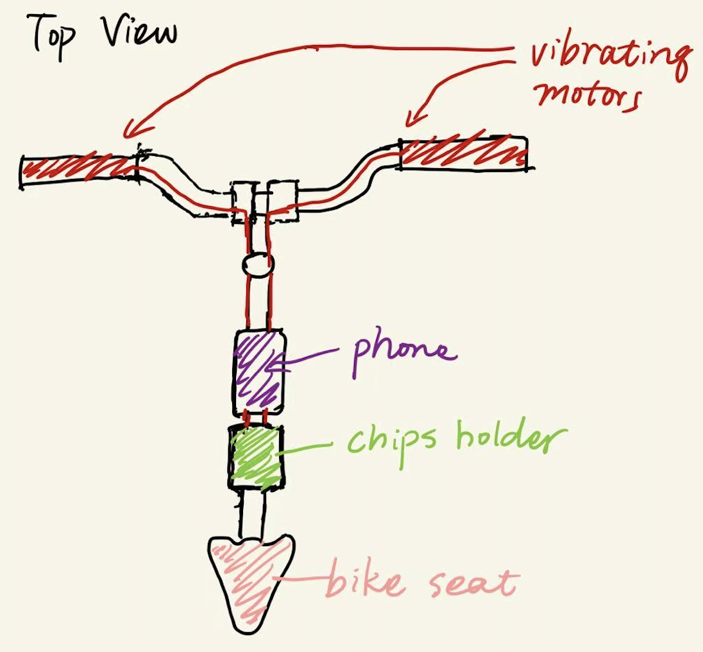
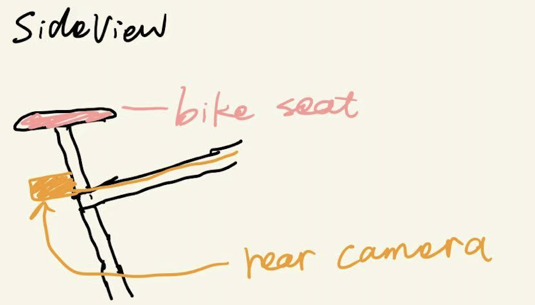

## Summary
BikeGuider is an intelligent navigation and safety system for bicyclists that uses handlebar-mounted vibration motors and a computer vision module to provide real-time directional guidance and collision warnings. Riders receive intuitive haptic cues to navigate city streets and avoid hazards without needing to glance at their phones.

## Project Description

### Problem
Cyclists navigating unfamiliar routes often rely on smartphones, which can be distracting and unsafe. They also have limited visibility of hazards approaching from behind or the side.

### Solution
BikeGuider replaces on-screen instructions with vibration-based turn-by-turn instructions and proximity-based collision warnings, powered by computer vision and sensor inputs. Integrated with Google Maps, it provides a familiar yet low-distraction experience optimized for safer urban riding.

## User Story
A cyclist mounts BikeGuider to their handlebars and rear rack. After setting a route via Google Maps, they begin riding. As turns approach, distinct vibration patterns on the handlebars signal the correct direction. If a vehicle nears from behind or the side, the corresponding side of the handlebar vibrates to alert the rider to the threat.

## Deliverables
### Minimum Viable Product (MVP)
- Handlebar-mounted vibration motors providing basic directional feedback (left, right, U-turn)
- Hardcoded routes for formative user studies (no live navigation)

### Target Product
- Handlebar-mounted vibration motors delivering refined, user-tested haptic patterns for intuitive navigation
- Computer vision module (mainly based on YOLO) detecting vehicles and pedestrians approaching from rear and sides, triggering hazard alerts
- Google Maps integration for real-time, dynamic turn-by-turn navigation

### Stretch Goals
- Companion mobile app allowing users to:
  - Customize vibration patterns and intensity
  - Switch between riding modes (e.g., urban mode: frequent hazard warnings; rural mode: reduced alert sensitivity)
  - Review ride summaries

  

    
  

  

    
  

## Metrics
- Reaction time to turns (target: >2 seconds before the turn)
- Accuracy for hazard detection (target: detects >90% of approaching vehicles/pedestrians within 5 meters)
- Usability (target: SUS > 75 for the final evaluation user studies)

## Materials

| **Item**                     | **Description**          | **Cost** |
|------------------------------|--------------------------|----------|
| ESP32-CAM (x2)               | Control                  | $20      |
| Vibration motors             | Haptic feedback          | $25      |
| MAX78000 dev board           | Edge CV model            | $40      |
| Relays, wiring, prototyping  | Electrical setup         | $30      |
| **Total**                    |                          | **$115** |

## Risk Assessment

| **Risk**                         | **Likelihood** | **Impact** | **Mitigation**                                                                          |
|----------------------------------|----------------|------------|-----------------------------------------------------------------------------------------|
| YOLO Model inference latency     | Medium         | High       | Try other models (e.g., EfficientDet, DETR) or hardwares (e.g., Raspberry Pi)|
| Ambiguous haptic patterns        | Medium         | Medium     | Conduct iterative user testing; provide customizable vibration profiles in the app     |

## Team Member Responsibilities
- Jiuyang Lyu: Vibration motor development
- Jun Wang: Computer vision, user study design, major website updates
- Simon Wang: Google Maps integration, mobile application development
