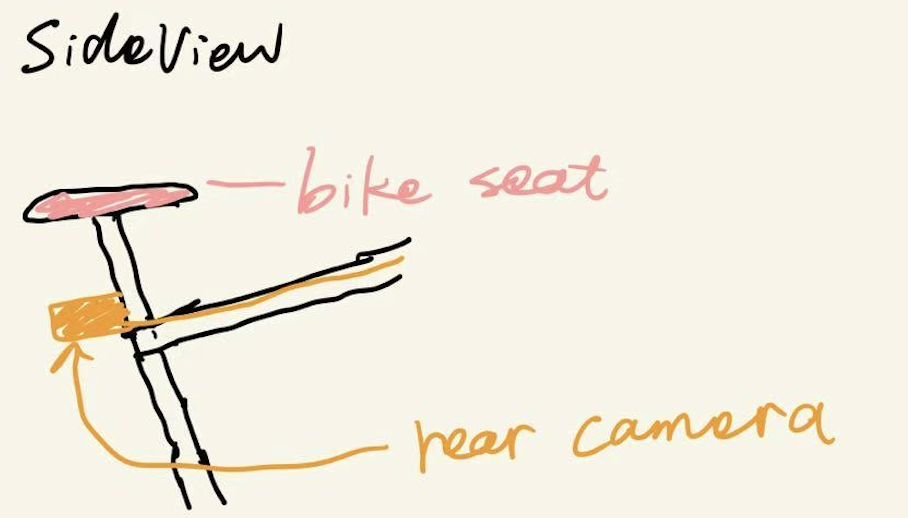

## Features Overview

BikeGuider focuses on two key functions: directional guidance and real-time safety alerts -- all delivered through subtle but effective haptic feedback.

### Directional Guidance via Handlebar Vibrations

To help riders stay focused on the road, BikeGuider replaces on-screen directions with tactile feedback. Vibration motors embedded in the handlebars gently alert the biker when it's time to turn:

- Left or Right Turns: When approaching a turn, the corresponding handlebar (left or right) will begin to vibrate, allowing the rider to intuitively know which direction to go—no screen-glancing needed.

- Missed Turns: If a rider misses a turn, both handlebars will vibrate in a short triple-pulse pattern, signaling the mistake and helping reroute the biker toward the correct path.

This system provides clear, non-intrusive guidance while minimizing distractions.

### Collision and Proximity Warnings

Bikers often face challenges detecting what's happening behind them—especially at higher speeds or in busy environments. To address this, BikeGuider supports mounting rear-facing cameras or proximity sensors on the bike. These are integrated into the system to detect approaching pedestrians or nearby vehicles or cyclists. When a potential hazard is detected, the handlebar will vibrate in a distinct pattern on the left or right side, depending on where the threat is coming from. This gives the rider an instant, intuitive cue to stay alert and adjust accordingly.

### Customizable Vibration Settings via Mobile App

To give users more control and flexibility, we plan to develop a companion mobile app that allows riders to:
- Customize vibration intensity and patterns for different types of cues (e.g., navigation vs. safety alerts)
- Choose preferred modes based on riding style or environment (urban vs. off-road)
- Connect to popular navigation apps like Google Maps for real-time route updates

 

  

    
  

  

    
  

