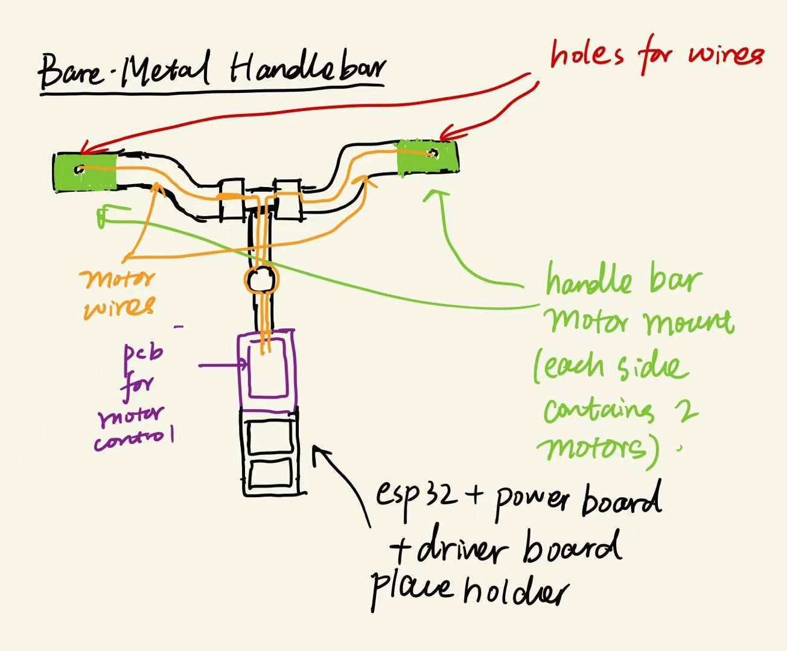

## BikeGuider Rapid Prototype Display 

BikeGuider consists of two core elements: a handlebar-mounted haptic module and a companion mobile app. 

The haptic module, powered by an ESP32 microcontroller, delivers programmable vibration intensity and patterns via 3D-printed mounts.

  <figure style="margin: 0;">
    
    <figcaption>Front view of the 3D-printed motor mount</figcaption>
  </figure>
  <figure style="margin: 0;">
    
    <figcaption>Side view showing attachment points</figcaption>
  </figure>

  
  <figcaption>Overall system sketch</figcaption>

<video width="600" controls>
  <source 
    src="{{ '/Video/vibrating_motor_demo.mp4' | relative_url }}" 
    type="video/mp4">
</video>

