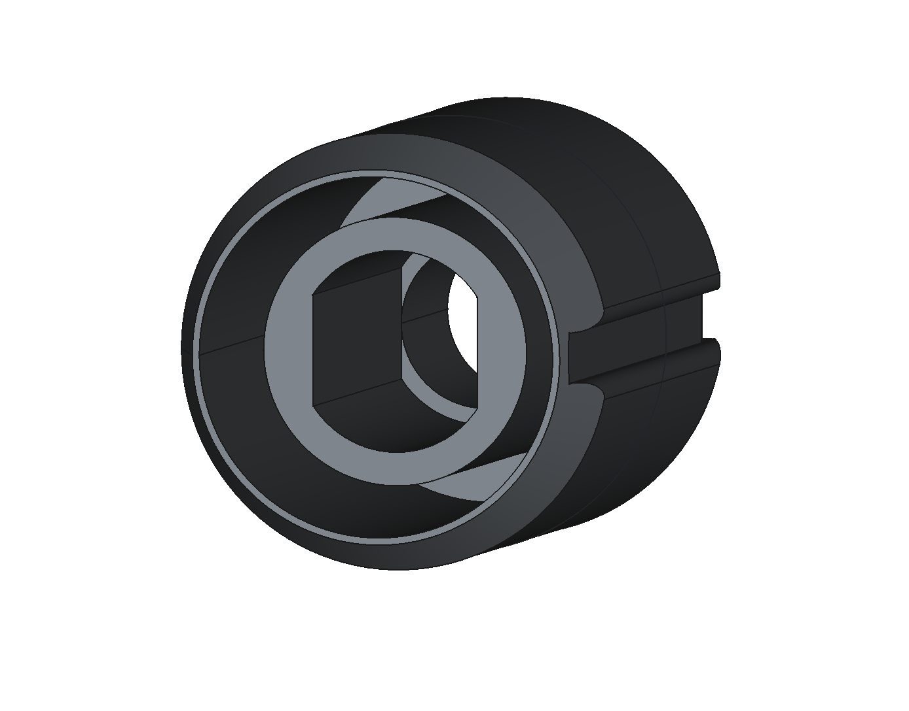
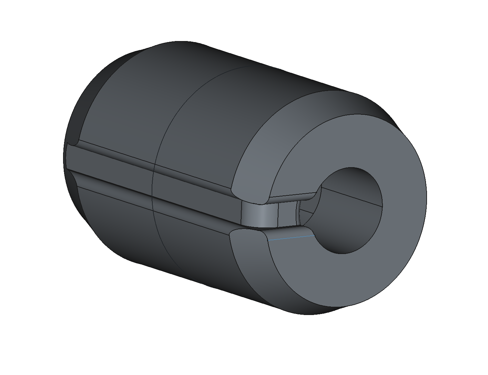

## BikeGuider Rapid Prototype Display 

Our BikeGuider project mainly composes of 2 main components: the hardware with the vibrating motors and a supporting app.

The hardware components have one esp32 chip to control the strength and pattern of the vibrating motor. 
The motors can be adapted to the handlebar with 3d printed components that fix the motors. 

  <figure style="margin: 0; text-align: center;">
    
    <figcaption>Front view of the 3D-printed motor mount</figcaption>
  </figure>
  <figure style="margin: 0; text-align: center;">
    
    <figcaption>Side view showing attachment points</figcaption>
  </figure>

